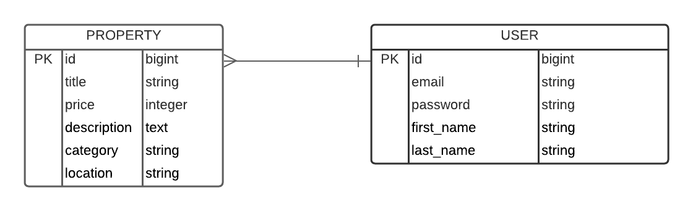

# Projet IMMO

Notre première API Rails en production! 🎉

[](https://forthebadge.com)

## Présentation du projet

Cette API gère une marketplace d'immobilier où les personnes qui vont utiliser le site vont pouvoir faire de l'achat/vente de biens immobiliers.

## Schéma de la base de données



## Versions utilisées

- Ruby: 2.7.1
- Rails: 6.1.3

## Lien de l'application associée en production

[IMMOCOIN](https://react-immo-coin.vercel.app/)

## La version finale

Ce que contient la **version finale** de l'API:

*BASE_URL* : https://api-immo-coin-dev.herokuapp.com/ 

- Requêtes utilisateur (*BASE_URL*/users)

* S'enregistrer
* Se connecter 
* Récupérer son profil utilisateur (avec 'Bearer')
* Modifier son profil (avec 'Bearer')
* Se déconnecter (avec 'Authorization Bearer')

- Requêtes annonces (*BASE_URL*/properties)

* Récupérer la liste des annonces 
* Récupérer les informations d'une annonce
* Créer une annonce (avec 'Bearer')
* Modifier une annonce (avec 'Bearer')
* Supprimer une annonce (avec 'Bearer')

## Lancement de l'API

```
git clone https://github.com/JAG-ROSA/React_ImmoCoin
bundle install
```

**Database**

```
rails db:create
rails db:migrate
rails db:seed
```

**Lancer le serveur**

`rails s`

## L'équipe

- **Morgane Tessier** _alias_ [@m-tessier](https://github.com/m-tessier)
- **Martin Forget** _alias_ [@Martinfzz](https://github.com/Martinfzz)
- **Arnaud Gossard** _alias_ [@JAG-ROSA](https://github.com/JAG-ROSA)
- **Carole Meney** _alias_ [@carolemny](https://github.com/carolemny)
