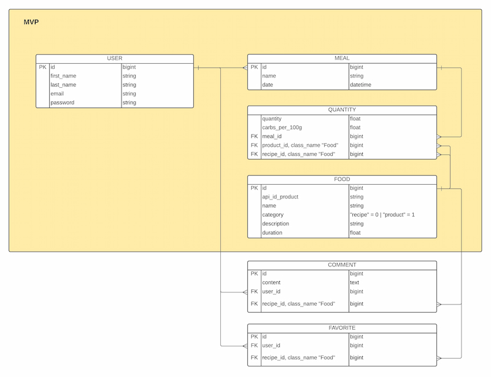

# GluciCalc - API application

<!-- TABLE OF CONTENTS -->
<details open="open">
  <summary>Table of Contents</summary>
  <ol>
    <li>
      <a href="#about-the-project">About The Project</a>
    </li>
    <li>
      <a href="#technical-stack">Technical Stack</a>
    </li>
    <li>
      <a href="#getting-started">Getting Started</a>
      <ul>
        <li><a href="#prerequisites">Prerequisites</a></li>
        <li><a href="#project-installation">Project Installation</a></li>
      </ul>
    </li>
    <li><a href="#api-usage">API Usage</a></li>
    <li><a href="#contributors">Contributors</a></li>
  </ol>
</details>

<!-- About The Project -->
# About The Project
**GluciCalc** is an application **for diabetics that calculates the amount of carbohydrates** in a meal based on commercial products or customised recipes.

Find more information about the project on [GluciCalc](https://github.com/JAG-ROSA/GluciCalc_Front.git).

<!-- Technical Stack -->
# Technical Stack
This Ruby on Rails API serves as a Back-End for the ReactJS [GluciCalc](https://github.com/JAG-ROSA/GluciCalc_Front.git) application.


### Languages and frameworks
* [Ruby - ver. 2.7.1](https://ruby-doc.org/core-2.7.1/)
* [Ruby on Rails - ver. 6.1.3](https://rubyonrails.org/)

### PostGreSQL database
The detailed database schema can be previewed below.



### Ruby Gems
* [Gem Devise](https://github.com/heartcombo/devise)
* [Gem Devise-JWT](https://github.com/waiting-for-dev/devise-jwt)
* [Gem Rack-Cors](https://github.com/cyu/rack-cors)
* [Gem MailJet](https://fr.mailjet.com/)
* [Gem Faker](https://github.com/faker-ruby/faker)

<!-- GETTING STARTED -->
# Getting Started
To get a local copy and run this project locally, please follow these steps.

## Prerequisites

Be sure to have the proper version of Ruby on Rails and Ruby installed on your machine.
1. Check your Ruby on Rails & Ruby version
```sh
rails -v
ruby -v
```
2. In case of older version, please run the following command line to install Ruby on Rails 
```sh
gem install rails -v 6.1.3
```
See Rails Guides for more information on how to install Ruby on Rails & Ruby : [Getting Started with Rails](https://guides.rubyonrails.org/getting_started.html#creating-a-new-rails-project-installing-rails)

## Project Installation

1. Clone the repo
```sh
  git clone https://github.com/carolemny/GluciCalc_Back.git
```
2. Install Gemfile bundle
```sh
  bundle install
```
3. Create a local PostgreSQL database  
```sh
  rails db:create
```
4. Run the database migration and generate the seed  
```sh
  rails db:migrate
  rails db:seed
```
5. Start the server
```sh
  rails server
```

# API Usage
BASE_URL : https://glucicalc-back.herokuapp.com/

Please find some example on how to use our API:

## User
### Register
```sh
  curl --request POST \
    --url http://localhost:3001/users \
    --header 'Content-Type: application/json' \
    --data '{
      "user": {
          "email": "yourname@test.com",
          "password": "yourpassword"
        }
      }'
```

### Login
```sh
  curl --request POST \
    --url http://localhost:3001/users/sign_in \
    --header 'Content-Type: application/json' \
    --data '{
      "user": {
          "email": "yourname@test.com",
          "password": "yourpassword"
        }
      }'
```

### Logout
```sh
  curl --request DELETE \
    --url http://localhost:3001/users/sign_out \
    --header 'Authorization: Bearer <jwt-token>' \
    --header 'Content-Type: application/json' \
```
  
### Get Profile
```sh
  curl --request GET \
    --url http://localhost:3001/users/<:id> \
    --header 'Authorization: Bearer <jwt-token>' \
    --header 'Content-Type: application/json' \
```
  
### Update Profile
```sh
  curl --request PUT \
    --url http://localhost:3001/users/<:id> \
    --header 'Authorization: Bearer <jwt-token>' \
    --header 'Content-Type: application/json' \
    --data '{
      "first_name": "YourFirstName",
      "last_name": "YourLastName"
    }'
```

## Meal

### Create Meal
```sh
  curl --request POST \
    --url http://localhost:3001/meals \
    --header 'Authorization: Bearer <jwt-token>' \
    --header 'Content-Type: application/json' \
    --data '{
      "name": "YourMealName"
    }'
```
### Destroy Meal
```sh
  curl --request DELETE \
    --url http://localhost:3001/meals/<:id> \
    --header 'Authorization: Bearer <jwt-token>' \
    --header 'Content-Type: application/json' \
    --data '{
      "name": "YourNewNameMeal"
      }'
```
### Get User Meal
```sh
  curl --request GET \
    --url http://localhost:3001/days/2021-06-23 \
    --header 'Authorization: Bearer <jwt-token>' \
```
For more specific actions, please visit our website platform

# Contributors
* [Carole](https://github.com/carolemny)
* [Arnaud](https://github.com/JAG-ROSA/)
* [Morgane](https://github.com/m-tessier)
* [Martin](https://github.com/Martinfzz)
